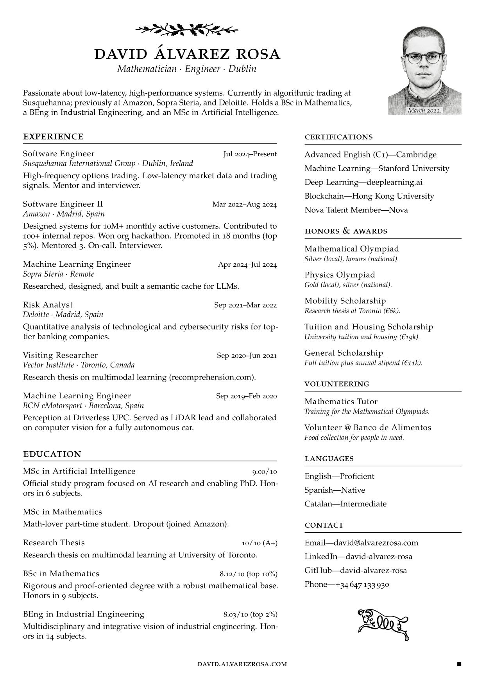

#+title: Curriculum Vitae
#+author: David Álvarez Rosa
#+email: david@alvarezrosa.com
#+language: en

The LaTeX source code of my personal Curriculum Vitae.

A single-page, two-column résumé set in Palatino with old-style figures
and small caps, refined by =microtype= for micro-typographic
adjustments.

Compile with =pdflatex= (requires a TeX distribution)

#+begin_src sh
pdflatex david-alvarez-rosa-cv.tex
#+end_src

#+html:  

With ❤️ by [[https://david.alvarezrosa.com/][David Álvarez Rosa]].
